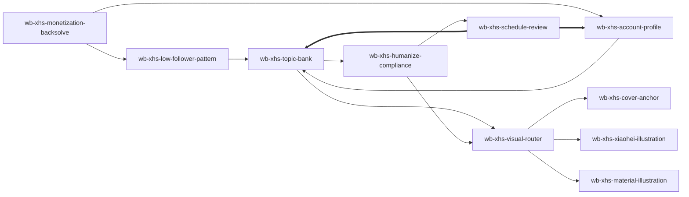

# WorkBuddy 小红书冷启动 — Skill Index

> 从公开长文方法论整理而来，产出 10 个可执行 Agent Skills。
> 处理时间: 2026-07-07

## 关于这篇文章

- **作者**: 文子 (@Eejoylove)
- **发布时间**: 2026-07-06
- **一句话主旨**: 先从变现路径倒推账号，再用 WorkBuddy 把对标、记忆、选题、改稿、排期复盘串成小红书冷启动系统。
- **融合补充**: 已融合 yanliudreamer 小红书系列，并提取 dbskill 与 xhs-visual-director-skill 中适合小红书场景的内容诊断、标题、对标、共鸣、视觉导演和复盘模块。
- **整篇理解**: [BOOK_OVERVIEW.md](./BOOK_OVERVIEW.md)
- **精华长文**: [DIGEST.md](./DIGEST.md)
- **术语词典**: [GLOSSARY.md](./GLOSSARY.md)
- **融合说明**: [FUSION_NOTES.md](./FUSION_NOTES.md)
- **dbskill 提取说明**: [DBSKILL_EXTRACTION_NOTES.md](./DBSKILL_EXTRACTION_NOTES.md)
- **视觉导演融合说明**: [VISUAL_DIRECTOR_FUSION_NOTES.md](./VISUAL_DIRECTOR_FUSION_NOTES.md)

## Skill 列表

### 定位与对标

- [`wb-xhs-monetization-backsolve`](./wb-xhs-monetization-backsolve/SKILL.md) — 先确认 offer、变现路径、timing 和个人 IP 路线，再倒推账号定位、内容方向、视觉信任感和验证计划。
- [`wb-xhs-low-follower-pattern`](./wb-xhs-low-follower-pattern/SKILL.md) — 找低粉爆款样本，用点击率 × 停留时长 × 互动率、对标过滤、共鸣解码和视觉骨架拆出可迁移结构。

### WorkBuddy 生产系统

- [`wb-xhs-account-profile`](./wb-xhs-account-profile/SKILL.md) — 为 WorkBuddy 建立账号档案、个人语言样本、可信主张、视觉身份和长期记忆。
- [`wb-xhs-topic-bank`](./wb-xhs-topic-bank/SKILL.md) — 用七类标题公式、标题触发器、五类用户底层需求和封面钩子建立可持续选题库。

### 发布与迭代

- [`wb-xhs-humanize-compliance`](./wb-xhs-humanize-compliance/SKILL.md) — 对 AI 初稿做人味化、单一核心机制、5 秒开头、图文拆页和平台表达检查。
- [`wb-xhs-schedule-review`](./wb-xhs-schedule-review/SKILL.md) — 制定前 10 条/30 天排期，并把内容生产、视觉生产和 10-20 条数据复盘写回账号档案。

### 视觉生产

- [`wb-xhs-visual-router`](./wb-xhs-visual-router/SKILL.md) — 预检视觉事实边界并把封面、黑白插图和素材请求交给正确专家。
- [`wb-xhs-cover-anchor`](./wb-xhs-cover-anchor/SKILL.md) — 以证据、主体、对照或文字承诺构建可信 3:4 封面。
- [`wb-xhs-xiaohei-illustration`](./wb-xhs-xiaohei-illustration/SKILL.md) — 用简洁黑白叙事插图表达已确认主题。
- [`wb-xhs-material-illustration`](./wb-xhs-material-illustration/SKILL.md) — 建立可复用的栏目素材与图文说明组件。

## 引用图



## 推荐使用顺序

1. `wb-xhs-monetization-backsolve`
2. `wb-xhs-account-profile`
3. `wb-xhs-schedule-review`
4. `wb-xhs-topic-bank`
5. `wb-xhs-humanize-compliance`
6. `wb-xhs-low-follower-pattern`
7. `wb-xhs-schedule-review`
8. `wb-xhs-visual-router`（需要图片时）

## 安装使用

把每个 skill 目录复制到 `~/.codex/skills/` 后，重启 Codex 即可调用。

```bash
cp -R wb-xhs-* ~/.codex/skills/
```

## 审计轨迹

- 候选单元池: [candidates/](./candidates/)
- 被淘汰候选: [rejected/](./rejected/)
- 阶段 0: [BOOK_OVERVIEW.md](./BOOK_OVERVIEW.md)
