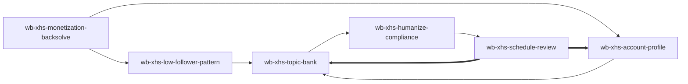

# WorkBuddy 小红书冷启动 — Skill Index

> 由 `cangjie-skill` 蒸馏，产出 6 个可执行 Agent Skills。
> 处理时间: 2026-07-07

## 关于这篇文章

- **作者**: 文子 (@Eejoylove)
- **发布时间**: 2026-07-06
- **一句话主旨**: 先从变现路径倒推账号，再用 WorkBuddy 把对标、记忆、选题、改稿、排期复盘串成小红书冷启动系统。
- **整篇理解**: [BOOK_OVERVIEW.md](./BOOK_OVERVIEW.md)
- **精华长文**: [DIGEST.md](./DIGEST.md)
- **术语词典**: [GLOSSARY.md](./GLOSSARY.md)

## Skill 列表

### 定位与对标

- [`wb-xhs-monetization-backsolve`](./wb-xhs-monetization-backsolve/SKILL.md) — 先确认变现路径，再倒推账号定位、内容方向和边界。
- [`wb-xhs-low-follower-pattern`](./wb-xhs-low-follower-pattern/SKILL.md) — 找低粉爆款样本，拆出可迁移的内容骨架。

### WorkBuddy 生产系统

- [`wb-xhs-account-profile`](./wb-xhs-account-profile/SKILL.md) — 为 WorkBuddy 建立账号档案和长期记忆。
- [`wb-xhs-topic-bank`](./wb-xhs-topic-bank/SKILL.md) — 用七类标题公式建立可持续选题库。

### 发布与迭代

- [`wb-xhs-humanize-compliance`](./wb-xhs-humanize-compliance/SKILL.md) — 对 AI 初稿做人味化和平台规则检查。
- [`wb-xhs-schedule-review`](./wb-xhs-schedule-review/SKILL.md) — 制定排期并用每周数据复盘下一轮内容。

## 引用图



## 推荐使用顺序

1. `wb-xhs-monetization-backsolve`
2. `wb-xhs-low-follower-pattern`
3. `wb-xhs-account-profile`
4. `wb-xhs-topic-bank`
5. `wb-xhs-humanize-compliance`
6. `wb-xhs-schedule-review`

## 安装使用

把每个 skill 目录复制到 `~/.codex/skills/` 后，重启 Codex 即可调用。

```bash
cp -R wb-xhs-* ~/.codex/skills/
```

## 审计轨迹

- 候选单元池: [candidates/](./candidates/)
- 被淘汰候选: [rejected/](./rejected/)
- 阶段 0: [BOOK_OVERVIEW.md](./BOOK_OVERVIEW.md)

